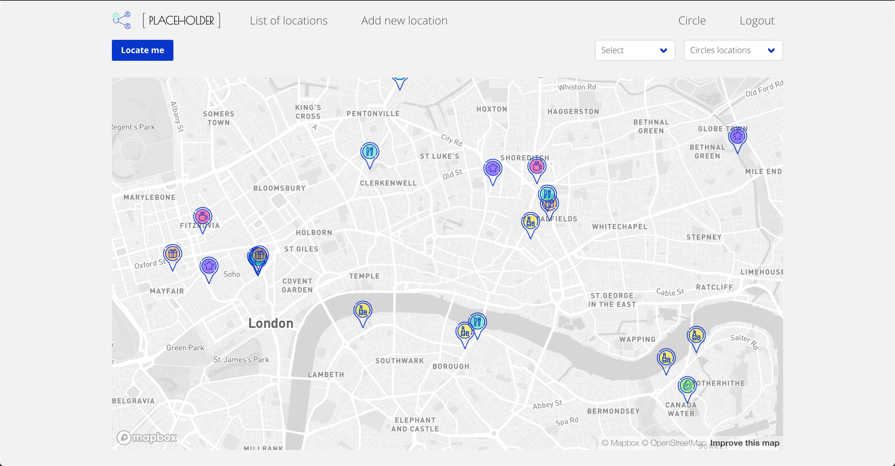
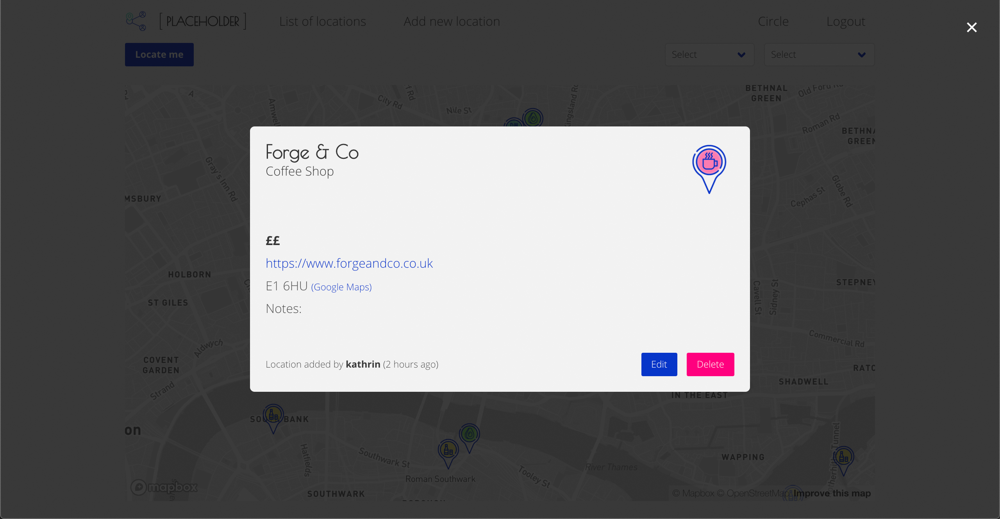
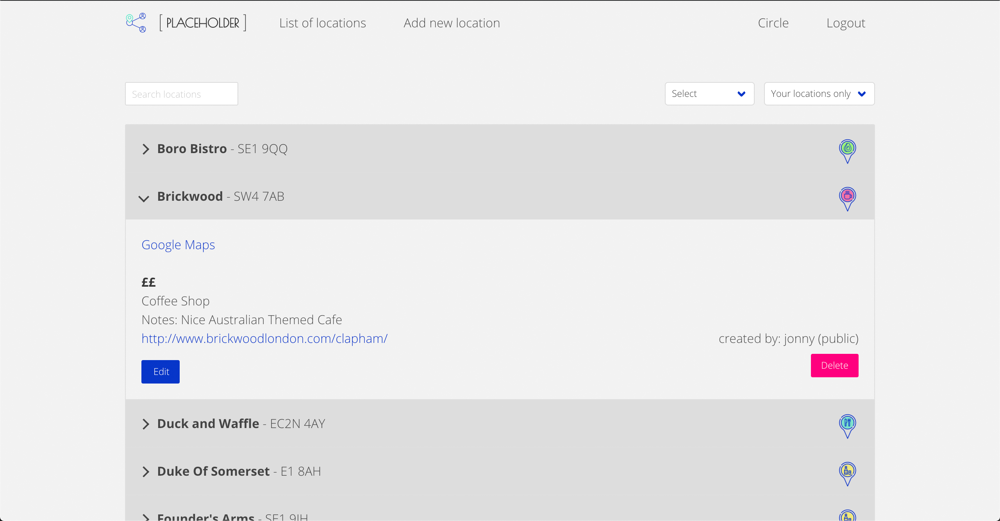
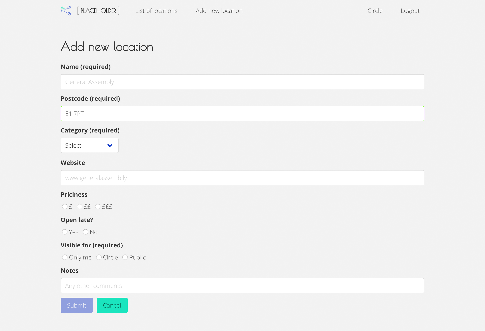
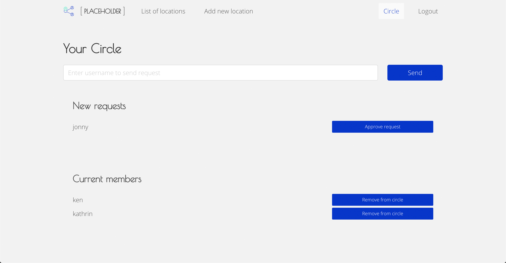

###  General Assembly, Software Engineering Immersive
# Project #3: Placeholder

## Overview

This is the third project of the software engineering immersive course at GA London. The assignment was to create a **full-stack application** in **teams of 3** and within **one week**.

You can launch the game on GitHub pages [here](url), or find the GitHub repo [here](url).

## Brief

* Work in a team, using **git to code collaboratively**.
* **Build a full-stack application** by making your own backend and your own front-end
* **Use an Express API** to serve your data from a Mongo database
* **Consume your API with a separate front-end** built with React
* **Be a complete product** which most likely means multiple relationships and CRUD functionality for at least a couple of models

## Technologies used
- HTML
- CSS
- JavaScript (ES6)
- React.js
- Express
- Mocha and Chai
- React Map GL (Mapbox)
- Postcode API
- Mongo and Mongoose
- React Toastify
- Moment
- Git and GitHub
- Bulma
- Google Fonts

## Approach

## Screenshots

## Future features

## Bugs / lessons learned

## Artwork and credit

Logo made by [Icongeek26](https://www.flaticon.com/authors/icongeek26) from [www.flaticon.com](https://www.flaticon.com/), all others made by Kathrin Eichinger in same style.

Pub icon made by [Freepik](https://www.freepik.com/) from [www.flaticon.com](https://www.flaticon.com/), all others made by Kathrin Eichinger in same style.

... and name provided by Michael Adair